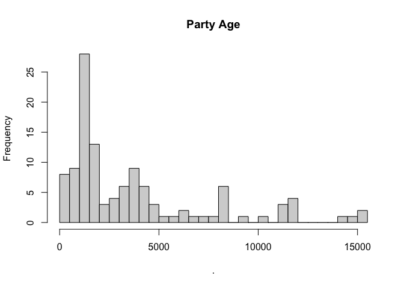
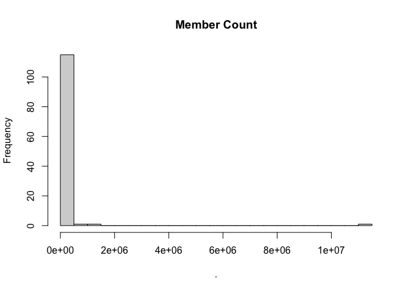
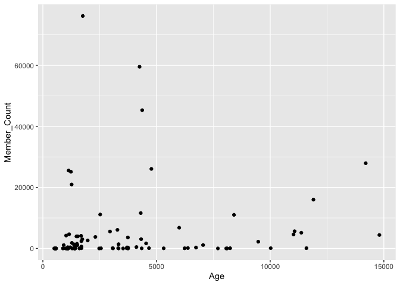

Determinants of Party Membership Levels in Turkish Political Landscape
================
Mehmet Sami Boz
2023-11-06

## Abstract

This research report employs regression analysis to examine the
determinants of party membership levels in the intricate landscape of
Turkish politics. With a focus on three primary independent
variables—party age, the presence of co-chairs, and data disclosure—our
study reveals that party age emerges as the most significant factor
influencing party membership, while the presence of co-chairs and the
extent of data disclosure fail to attain statistical significance. By
utilizing a refined dataset that excludes the AKP and parties with
nominal memberships, we emphasize the reliability of our results. These
findings provide valuable insights into the dynamics of political
participation in Turkey, ultimately contributing to a nuanced
understanding of party engagement. The report underscores the importance
of considering party age in strategic planning and encourages further
exploration of related factors, including better constructed openness
variables and the impact of constitutional changes, to enrich our
comprehension of Turkish political party dynamics.

## Introduction

The vibrant and dynamic landscape of Turkish politics has undergone
significant transformations over the years, reflecting the multifaceted
nature of its democracy. Central to this democratic process are the
political parties that form the cornerstone of the nation’s political
infrastructure. The composition and strategies of these parties play a
pivotal role in shaping the political discourse and in mobilizing
citizens to participate in the democratic process. This research seeks
to shed light on the underlying Party charateristics that influence
party membership, with a particular focus on the independent variables
of party age, the presence of co-chairs, and the extent of comprehensive
data disclosure.

Turkey’s political party system has evolved over time, adapting to
changing societal dynamics and political realities. As parties navigate
the complex Turkish political terrain, one pertinent question arises:
does the age of a political party have an impact on its ability to
attract and retain members? Political parties with longer histories may
be expected to have developed a broader base of support, while newer
parties may struggle to gain a foothold. Similarly, the leadership
structure within a party can have profound effects on its appeal and
organizational dynamics. The presence of co-chairs, especially of
varying age groups, may contribute to distinctive party images and
membership recruitment strategies.

Furthermore, the level of information disclosure by political parties
can significantly affect their ability to connect with potential
members. The degree to which parties share a simple information about
their chair name, telephone, and adress can represent their willigness
to be more transparent. Transparency may affect the public’s perception
of a party’s transparency and trustworthiness \[need reference\]. As the
political landscape evolves and citizens demand increased
accountability, understanding the role of information disclosure in
attracting party members becomes essential.

This research endeavors to explore and dissect the intricate
relationships between party age, the presence of co-chairs, and the
extent of data disclosure by political parties, and their potential
impact on party membership in Turkey. Through empirical analysis of
publicly available data on active political parties, this study aims to
provide insights into the dynamics of political participation in the
Turkish context and, in turn, offer valuable guidance for political
parties and policymakers striving to enhance their engagement with the
electorate. The findings of this research may hold significance not only
for the Turkish political landscape but also for broader discussions on
political participation, party dynamics, and the role of transparency in
contemporary democracies.

## Data

According to constitiution of the Turkish republic and relevant
law\[siyasi partiler yasası reference\] the court of cassation holds
information and oversees political parties in Turkey. And the court
publish general information on parties annually. The dataset to dive
into our research question Those genreal information tables collected
via web scraping.

The original dataset includes Party name, Chair Name, Telephone,Adress
and Member count of the parties. Further variables like having co-chair
or not and party age can be generated existing variables. In this
analysis party ages are calculated as days instead of years.

Since these information are simple and basic, the variable named
openness can represent the party’s willingness to be transparent and be
accountabile. To create the variable we used the following methodology;
maximum score is 5 and for every missing data party lose 1 points.

## Analysis

| **Characteristic** | **N** |   **N = 128**   |
|:-------------------|:-----:|:---------------:|
| **Age**            |  115  |  1,973 (3,722)  |
| **Member_Count**   |  118  | 362 (1,042,558) |
| **Openness**       |  128  |                 |
| 1                  |       |    3 (2.3%)     |
| 2                  |       |    1 (0.8%)     |
| 3                  |       |    9 (7.0%)     |
| 4                  |       |    61 (48%)     |
| 5                  |       |    54 (42%)     |
| **Have_cochair**   |  128  |                 |
| FALSE              |       |    122 (95%)    |
| TRUE               |       |    6 (4.7%)     |

As seen from median and standard deviation our dependent variable is
highly skewed.We lost significant amount of data due to age but the
regression has enough observaiton to be robust.

Turkish political environment consist of Younger parties but members
amount is Highly skewed due to AKP’s 11 milllion mmebership level.

<!-- -->

With member threshold 100k there seem to no linear relationship between
Age and Party population.

The table provides an overview of the regression results on party
membership count, considering three key independent variables. The model
reveals that party age stands out as the most influential factor in both
regressions. The first regression utilizes the complete dataset, while
the second excludes the AKP and parties with zero membership numbers we
can call them “zombie parties”.

The second dataset, which omits what can be termed as “zombie parties”
and the AKP, known for its prolonged governance in Turkey, is considered
more reliable for analysis. This is due to the likelihood that AKP’s
membership figures may be influenced by its extended period in
government.

In summary, the research findings indicate that party age significantly
contributes to explaining party membership levels. However, the other
variables under consideration do not exhibit a statistically significant
impact on membership counts.

Further investigation into this relationship and research question may
involve employing binary openness variables or the incorporation of
time-event categorical variables, such as parties founded before or
after the 2010 constitutional change.
